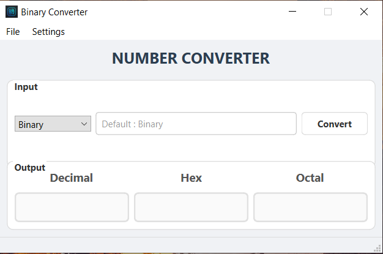

# 🔢 Number Converter

A modern desktop application built with **Python** and **PyQt6** to convert numbers between Binary, Decimal, Hexadecimal, and Octal formats instantly.

## 📖 About The Project

This is my second project on GitHub. The main goal was to understand the structure of complex GUI applications. Unlike simple scripts, this project implements a full **MVC (Model-View-Controller)** pattern.

I built this tool to master:

* `QMainWindow` structure
* `QStatusBar` for user feedback
* `QMenuBar` for application controls
* Dynamic styling (Dark/Light themes)

## ✨ Features

* 🔄 **Multi-Base Conversion:** Converts between Binary, Decimal, Hex, and Octal.
* 🎨 **Theme Support:** Switch between **Dark** and **Light** modes to suit your preference.
* ⌨️ **Shortcuts:**
  * `CTRL+D`: Switch to Dark Theme
  * `CTRL+L`: Switch to Light Theme
* ⚡ **Instant Calculation:** Uses Python's native bitwise operations for fast conversion.
* 🛡️ **Error Handling:** Validates user input and prevents crashes.

## 🛠️ Technologies Used

* **Python 3.x**
* **PyQt6** (User Interface)

### Developed by Selim Utku Sönmez*
